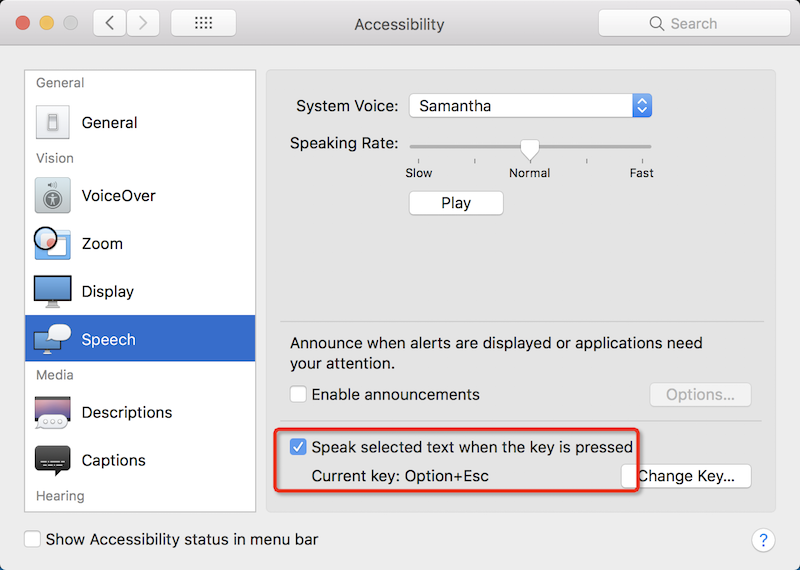

作为英语渣渣，每天阅读英语资料是工作必不可少的事项。其实，macOS内建的英语工具词典，能够很方便我们阅读时翻译单词：

在macOS中，使用"三指"轻点英语单词就可以弹出英语单词解释（通过内建的硬汉词典）。

当然，如果chrome安装了translater插件，在chrome浏览网页时，也能很方便选择片段进行翻译。

不过，很多人没有注意到，其实，macOS中还有一个非常有利于英语学习的功能：文本朗读。

* 苹果菜单 >“系统偏好设置”，点按“辅助功能”，然后点按“语音”。
* 选择“按下按键时朗读所选文本”复选框。

默认情况下，按下 `Option-Esc` 将启用朗读。

阅读可以选择男声或者女声，虽然是机器合成的语音，语调略有机械感，但是由于朗读的原声是英美人士，读音还是比较标准的。方便我们模仿学习。

英文版macOS设置界面如下：

# 参考

* [macOS Sierra: 听 Mac 朗读文本](https://support.apple.com/kb/ph25639?locale=zh_CN)