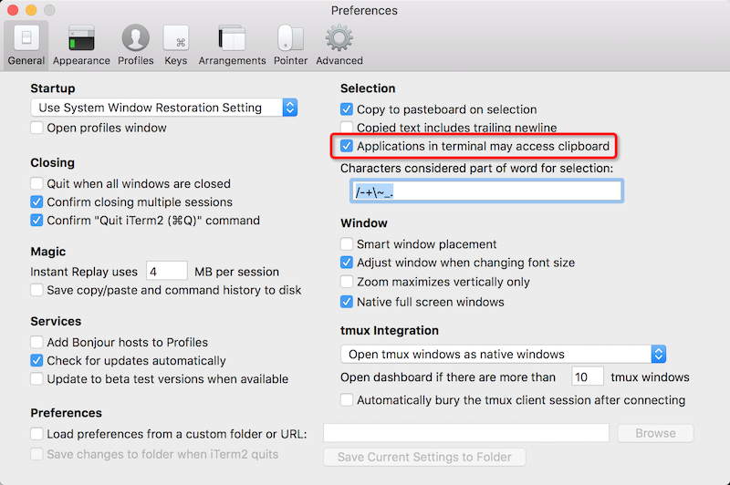

# MacOS 本地剪贴板复制

在MacOS中，如果要将文件复制到剪贴板，在终端中可以执行：

```bash
cat ~/Desktop/example.txt | pbcopy
```

然后就可以复制到其他位置：

```bash
pbpaste > ~/Documents/example.txt
```

> 注意：上述通过`pbcopy`和`pbpaste`只能在MacOS本地执行

# 结合iTerm2的远程复制内容到本地MacOS剪贴板

iTerm2有一个允许终端程序使用`escape`代码来控制剪贴板的功能，这样就可以使用bash脚本功能来实现Mac上的`pbcopy`。在远程Linux服务器的`~/.bashrc`中添加如下内容：

```bash
function pbcopy {
    base64 -w 0| xargs -0 -d "\n" -n1 -I {} bash -c "echo -ne '\e]52;;{}\e\\'"
} 
```

然后在iTerm2的设置中开启允许`Applicatins in terminal may access clipboard`



之后，再次访问远程服务器，就可以直接使用如下命令将远程文件内容复制到本地Mac的剪贴板：

```
cat data.txt | pbcopy
```

> 上述方法验证下来，复制到剪贴板中文件内容略有一点点差异，主要是有些空白行会多一些空格，但总体没有什么大问题。可作为备用方案。

> 在[How do I copy to the OSX clipboard from a remote shell using iTerm2?](https://apple.stackexchange.com/questions/257609/how-do-i-copy-to-the-osx-clipboard-from-a-remote-shell-using-iterm2)还有一个通过在本地启动一个Daemon监听端口，将远程SSH输出到`STDIN`然后放入剪贴板的方法，不过实现太麻烦了。

# Linux主机的剪贴板复制

对于Linux主机，要实现`pbcopy`实际上采用的是X平台的`xsel`或`xclip`，不过两者都要求工作在X图形界面。将以下配置加入到`~/.bashrc`中

```bash
alias pbcopy='xsel --clipboard --input'
alias pbpaste='xsel --clipboard --output'
```

或者

```bash
alias pbcopy='xclip -selection clipboard'
alias pbpaste='xclip -selection clipboard -o'
```

然后就可以使用

```
echo 'go to my clipboard' | pbcopy
```

如果没有使用X，则使用GNU Screen功能在不同到shell中复制：

复制：

```
Ctrl-a -> Esc -> go to wanted position * -> Space (to begin selecting) -> press k to go forward mark text -> Enter
```

粘贴：

```
Ctrl-a + ]
```

# 参考

* [using terminal to copy a file to clipboard](https://apple.stackexchange.com/questions/15318/using-terminal-to-copy-a-file-to-clipboard)
* [Copying to OSX Clipboard from Remote Linux Terminal in iTerm2](http://www.sergeymarkov.com/blog/2013/07/copying-to-osx-clipboard-from-remote-linux-terminal-in-iterm2/)
* [What's like OSX's pbcopy for Linux](https://superuser.com/questions/288320/whats-like-osxs-pbcopy-for-linux)