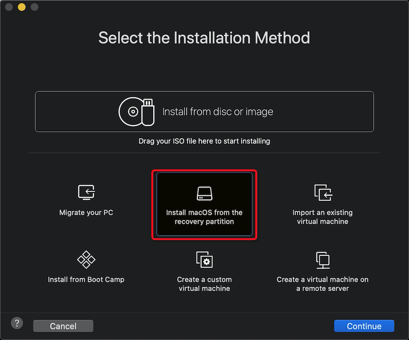
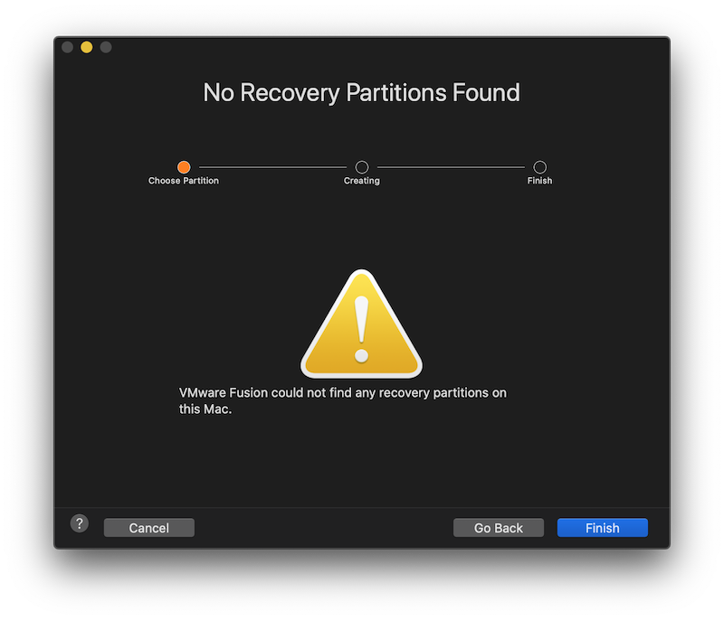

经过实践发现，实际上VMware install macos from recovery partition还是需要先从App Store下载本机操作系统对应的安装程序才能进行。实际上并不能安装旧版本macOS，因为App Store压根就不允许下载比自己本机更低的macOS版本。

* 启动VMware Fusion软件，然后选择 `install macOS from the recovery partition` 选项，然后点击 `Continue` 按钮：



* 在高版本macOS上VMware似乎不支持从recovery partition直接安装了，很遗憾，此时看到一个 `No Recovery Partitions Found` 提示



不过，使用命令行是完全可以看到有一个recovery partition的：

```
% diskutil list
/dev/disk0 (internal, physical):
   #:                       TYPE NAME                    SIZE       IDENTIFIER
   0:      GUID_partition_scheme                        *500.3 GB   disk0
   1:                        EFI EFI                     209.7 MB   disk0s1
   2:                 Apple_APFS Container disk1         500.1 GB   disk0s2

/dev/disk1 (synthesized):
   #:                       TYPE NAME                    SIZE       IDENTIFIER
   0:      APFS Container Scheme -                      +500.1 GB   disk1
                                 Physical Store disk0s2
   1:                APFS Volume macOS - Data            86.5 GB    disk1s1
   2:                APFS Volume Preboot                 86.1 MB    disk1s2
   3:                APFS Volume Recovery                528.5 MB   disk1s3
   4:                APFS Volume VM                      5.4 GB     disk1s4
   5:                APFS Volume macOS                   11.0 GB    disk1s5
```

* 需要从AppStore中安装一个操作系统对应的Installer，然后就可以进行安装。实际上这就限制了只能安装当前操作系统版本，或者比当前操作系统更高的版本 - 因为苹果的App Store不会提供旧版本。从App Store下载了Catalina Installer之后，果然将Installer Application拖放到VMware Fusion的安装镜像对话框中，就可以自动识别操纵系统版本，并进行安装。

> 注意：在 `/Volumes` 卷目录下不能挂载其他版本的安装卷，否则 VMware Fusion无法创建安装介质。


# 参考

* [How to fix VMWare Fusion Pro 10, “could not find any recovery partitions on this Mac”](How to fix VMWare Fusion Pro 10, “could not find any recovery partitions on this Mac”)